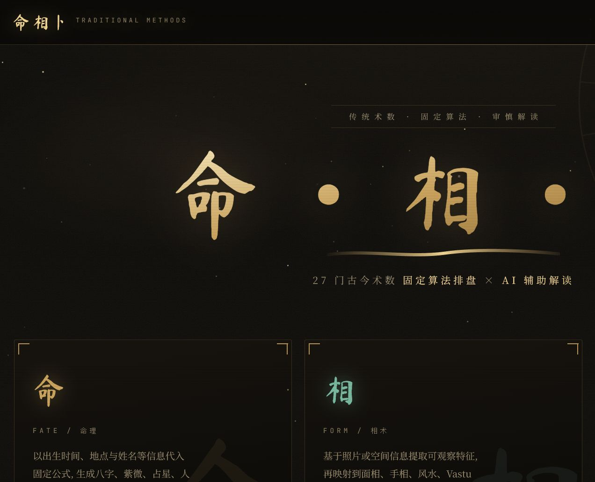
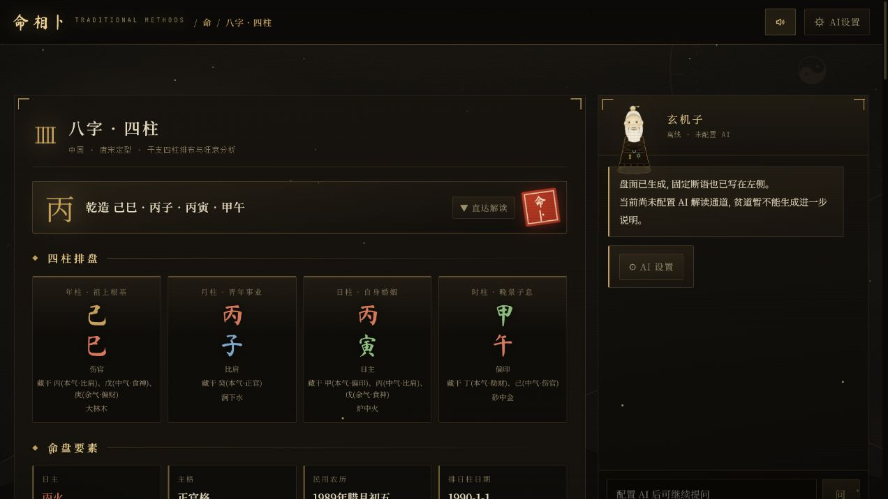

# 命相卜

**27 门古今术数 · 固定算法排盘 · AI 辅助解读**

面向传统文化研习与个人反思的本地优先 Web 应用

[在线体验](https://deepseery-jpg.github.io/Mr.Xuanjizi/) · [项目预览](#项目预览) · [功能矩阵](#功能矩阵) · [快速开始](#快速开始) · [技术架构](#技术架构) · [方法边界](#传统对齐与方法边界)

> [!IMPORTANT]
> 本项目把“固定算法排出的盘面事实”“传统体系中的象义解释”和“现实判断”分开呈现。它用于文化研习与个人反思，不构成医疗、法律、投资等专业建议。

## 项目简介

命相卜将命理、相术和占卜三类体系组织在同一个界面中。天文历法、干支节气、农历置闰、安星诀、遁甲布局和地占衍卦等固定计算均由 TypeScript 在浏览器本地完成；AI 是可选解读层，不影响离线排盘。

- **固定算法优先**：先生成可复核的结构化盘面，再展开固定断语或调用 AI。
- **本地优先**：无需后端即可排盘；API Key 只保留在当前页面内存中。
- **三类 27 门**：命 13 门、相 4 门、卜 10 门，覆盖中式与异域、传统与现代体系。
- **多模型接入**：支持 OpenAI、Anthropic、Gemini、DeepSeek、通义千问、Kimi/Moonshot 及 OpenAI 兼容接口。
- **沉浸式交互**：玄铁描金界面、水墨转场、仪式化起课，以及可响应流程的“玄机子”形象。
- **边界透明**：在盘面与文档中明确算法来源、简化项、待考项和流派分歧。

## 项目预览

### 首页

### 八字排盘结果

以下截图使用演示数据在本地生成，未配置 AI；右侧会明确显示当前为离线固定解盘状态。

## 功能矩阵

| 分类 | 数量 | 已实现体系 |
| --- | :---: | --- |
| **命** | 13 | 一键全术数、八字四柱、紫微斗数、韩国四柱 사주、西方占星、吠陀占星、藏历占星、数字命理、姓名学五格、人类图、玛雅卓尔金历、阿兹特克圣历、爪哇 Weton |
| **相** | 4 | 面相、手相、玄空风水、Vastu Shastra |
| **卜** | 10 | 易经六爻、梅花易数、塔罗 78 牌、卢恩符文、奇门遁甲、大六壬、太乙神数、伊法 Ifá、沙卜 Ilm al-Raml、Sikidy 籽卜 |

### 交互方式

不同体系使用与其结构相匹配的起课方式：

- 掷铜钱：六爻
- 扇形抽牌：塔罗
- 符文石：卢恩
- 沙盘点划：Raml / Sikidy
- 奥佩雷链：Ifá
- 星轨与罗盘推演：命理、占星、奇门、六壬等固定排盘

随机过程来自用户的实际操作；固定盘面则由对应算法生成。

## 快速开始

### 环境要求

- Node.js 18+
- npm 9+
- 现代浏览器

### 本地开发

~~~bash
npm install
npm run dev
~~~

访问 <http://127.0.0.1:5174>。开发服务器只绑定本机地址，端口固定为 5174。

### 生产构建

~~~bash
npm run check
npm run build
npm run preview
~~~

| 命令 | 用途 |
| --- | --- |
| **npm run dev** | 启动 Vite 开发服务器 |
| **npm run check** | 执行 TypeScript 类型检查 |
| **npm run build** | 类型检查并生成生产构建 |
| **npm run preview** | 在本机预览生产构建 |

## AI 解读配置

固定排盘不依赖 AI。需要进一步解读或使用“相”类图像观测时，在右上角 **AI 设置** 中配置：

1. 选择模型服务商；
2. 填入 API Key；
3. 确认接口地址和模型名；
4. 可选开启深度思考与真太阳时校正。

内置服务商模板包括 OpenAI、Anthropic、Google Gemini、DeepSeek、通义千问、Kimi/Moonshot 和 OpenAI 兼容接口。

> [!NOTE]
> API Key 不写入仓库、localStorage 或 sessionStorage，刷新页面后需要重新输入。普通设置和生辰档案会保存在浏览器本地；最近一次盘面保存在当前会话中，保存前会剥除 API Key 与图片。

## 技术架构

~~~mermaid
flowchart LR
  A["用户输入 / 仪式交互"] --> B["TypeScript 固定算法"]
  B --> C["结构化 ChartResult"]
  C --> D["盘面渲染与固定解读"]
  C --> E{"是否配置 AI"}
  E -- "否" --> D
  E -- "是" --> F["模型 API 辅助解读"]
  F --> G["流式文本 / 可视化画布"]
~~~

### 核心目录

~~~text
src/
├─ core/          # 天文、历法、AI、存储、聚合与公共类型
├─ modules/       # 27 门术数的输入定义、固定算法与输出
├─ components/    # 应用舞台、表单、仪式、解读与玄机子
├─ data/          # 卦象、塔罗、符文、姓名等静态数据
├─ styles/        # 全局视觉、响应式布局与动效
├─ App.tsx        # 首页、分类导航、设置与页面状态
└─ main.tsx       # React 入口
~~~

### 技术要点

- **天文引擎**：Meeus 太阳/月亮黄经、Standish 行星根数、上升与天顶、均时差、Lahiri 岁差。
- **中式历法**：定朔定气农历、无中气置闰、二十四节气、干支、十二长生、人元司令、刑冲合害、大运与神煞。
- **藏历引擎**：Phugpa 真月、重日/缺日、闰月与洛萨计算。
- **统一输出**：各模块生成结构化盘面、固定断语、AI 上下文与追问建议。
- **会话恢复**：刷新后可恢复当前页面与最近盘面，同时剥除密钥和图片字段。
- **前端安全基线**：自托管字体、CSP、无后端密钥存储。

## 传统对齐与方法边界

项目尽量用古籍课例、立成表、历法锚点和公开算法复核关键规则，同时明确标注未覆盖内容。详细说明已拆分到：

**[传统对齐与方法边界](./docs/traditional-alignment.md)**

需要特别注意：

- 八字旺衰、用神、格局等属于多层判断，程序评分只作为可解释的启发式结果。
- 六爻用神、六壬课体、奇门格局、太乙阴阳遁等存在流派或师承差异，盘面会标明候选、推定或待考。
- 相术和 Vastu 的图像处理是结构化特征分类，不应被理解为身份、健康或命运识别。
- 西方占星、吠陀、人类图、玛雅、阿兹特克、Weton、Ifá、Raml、Sikidy 等采用各自的中性解读口径，不冒称国学正统。
- 重要决定仍应结合现实信息与合格专业人士的意见。

## 免责声明

本项目用于传统文化研习、算法实验与个人反思。所有盘面与解读都不构成医疗诊断、法律意见、投资建议、心理评估或现实决策替代方案。
